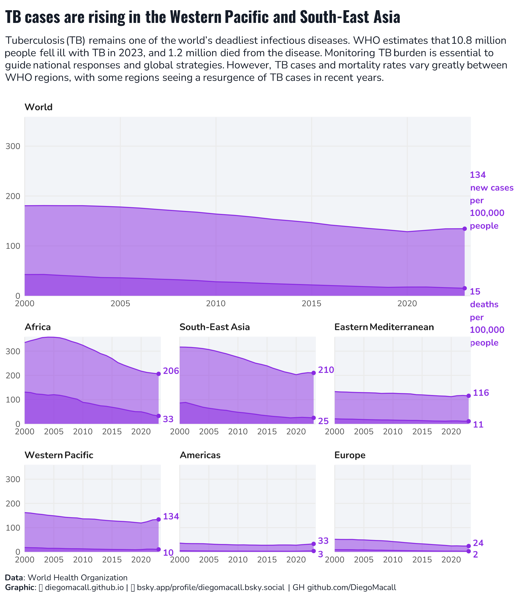

# 🎨 Graphics Portfolio — Diego M. Macall

**Transforming data into clarity.  
Visuals that connect science, policy, and design.**

---

## 🌆 About
I’m **Diego M. Macall**, a researcher and visual analyst specialized in environmental systems, sustainability, and data storytelling.  
This portfolio showcases my ability to translate complex datasets into clear, elegant, and insightful visuals combining scientific precision with design discipline.

Each folder contains:
- 🖼️ A high-quality figure or infographic  
- 🧮 The code used to generate it (R or Python)  
- 📜 A short description and data source  

---

## 🗂️ Portfolio Highlights

### 1️⃣ Urban Sustainability Dashboard

> *A data-driven synthesis of Barcelona’s rooftop agriculture potential and its contribution to the city’s food metabolism.*

---

### 2️⃣ Comparative City Maps

> *Comparative spatial analysis of Barcelona, Chicago, Rome, and Tashkent — exploring density, sunshine, and green-space metrics.*

---

### 3️⃣ Institutional Network

> *Mapping the governance ecosystem regulating urban agriculture — from municipal to European levels.*

---

### 4️⃣ Economic Surplus Visualization

> *Visualizing welfare changes from agricultural innovation adoption using the economic surplus framework.*

---

### 5️⃣ Resource Flow Diagram

> *Tracing material and energy flows in urban food systems through a Sankey diagram.*

---

### 6️⃣ Infographic Timeline

> *Chronology of the circular bioeconomy — key milestones from 1990 to 2025.*

---

### 7️⃣ Interactive Visualization

> *Interactive exploration of rooftop production potential across city districts (Shiny/Dash app demo).*

---

### 8️⃣ Tidy Tuesday

> *tidytuesday World TB Example*

### 9️⃣ Financial Dashboard — Half-Year 2025
 
> KPIs, composition, and period-over-period deltas in a compact layout.

---

## ⚙️ Tools & Languages
| Type | Tools |
|------|-------|
| **Programming** | R, Python |
| **Visualization** | ggplot2, matplotlib, plotly, tmap, patchwork |
| **Geospatial** | sf, geopandas, rnaturalearth |
| **Dashboards** | Shiny, Dash, Power BI |
| **Design & Layout** | Illustrator, Figma, Canva |

---

## 🎨 Visual Philosophy
> “Clarity is the highest form of elegance.”  
> Every visual should tell a story, whether it’s a regression curve, a network, or a city map.  
> My design language is rooted in precision, balance, and calmness.

---

## 🪪 License
This repository and its contents are licensed under a  
**Creative Commons Attribution–NonCommercial 4.0 International License.**  
[Read license terms →](https://creativecommons.org/licenses/by-nc/4.0/)

---

## 📬 Contact
👨‍💻 **Website:** [diegomacall.github.io](https://diegomacall.github.io)  
✉️ **Email:** diego.macall@usask.ca  
🔗 **LinkedIn:** [linkedin.com/in/DiegoMacall](www.linkedin.com/in/diego-macall)  
📘 **Bluesky:** [@diegommacall.bsky.social]([https://bsky.app/profile/diegomacall](https://bsky.app/profile/diegommacall.bsky.social))

---
